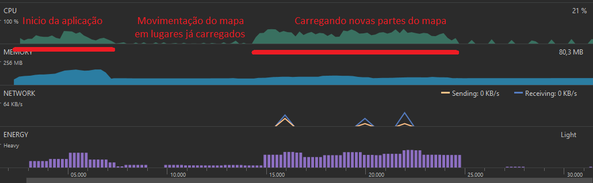

## Bateria
O uso de bateria é um ponto que poderia ser melhroado em nossa aplicação. Como dito no relatório de CPU, nossa aplicação é location-critical, e por causa disso ela faz checagens na atualização da localização do usuário com a frequência padrão estipulada pelo controlador padrão da API, o qual não é ideal em relação a economia de bateria, mas como esse uso extra de banda e CPU é necessário para o funcionamento da aplicação, e el sóa contece quando a aplicação está ativa, foi julgado por nós como um mal necessário.

